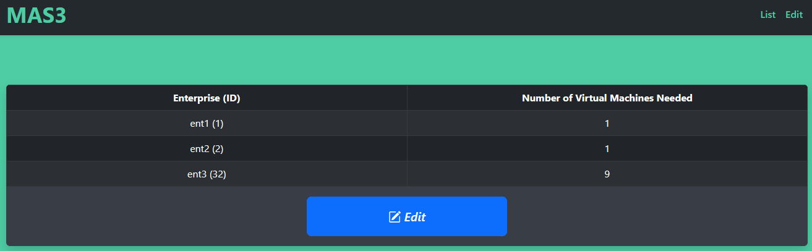
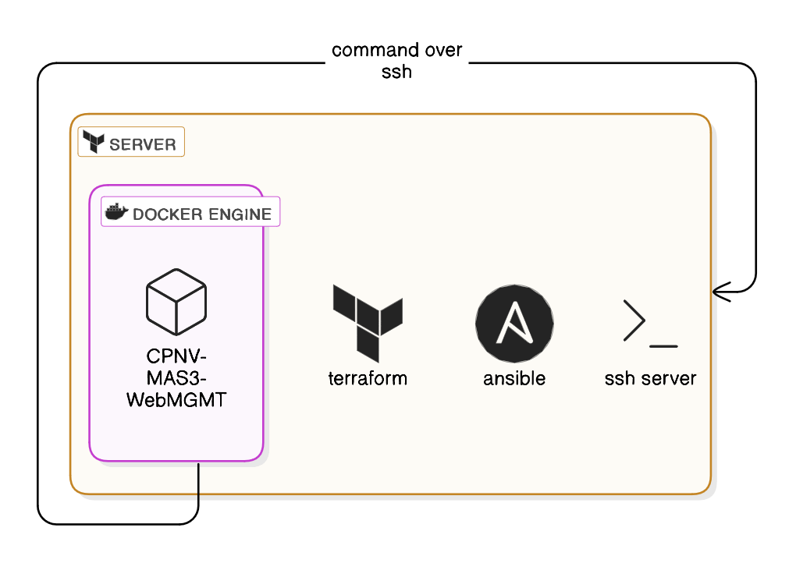

# CPNV-MAS3-WebMGMT
*This project complete the https://github.com/CPNV-ES-MAS3/yann_anthony project. It provides an simple web interface to edit a json list of clients and update their infrastructure with terraform (terraform apply over ssh command)*

# Requirements
- Python=>3.9.5
- Flask=>3.1.0

# Usage

## Docker
```
git clone git@github.com:YFanha/CPNV-MAS3-WebMGMT.git
cd CPNV-MAS3-WebMGMT
```
Update the ```data.json``` source file with your ```terraform.tfvars.json``` file.
```docker
docker-compose up -d --build
```

Setup the public key to allow docker container to launch command from SSH
```
cat /tmp/docker_ssh_key.pub >> ~/.ssh/authorized_keys
```

### SSH command 


## Host
### pipenv
```PowerShell
pip install pipenv
cd src
pipenv install

python3 run.py
```
